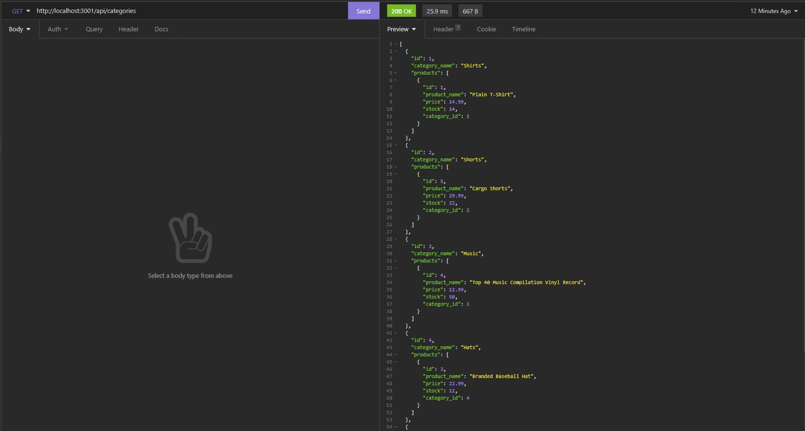
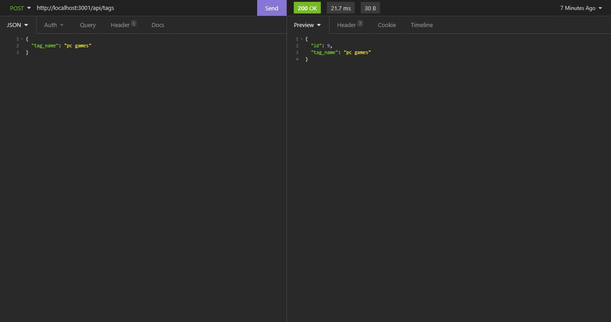

# ORM E-Commerce Back End

  ## License
  

## Description
A back end application for an e-commerce site using Express.js API and Sequelize to interact with a MySQL database.

## Screenshots
### GET Category Route
  
### POST Tag Route
  

## Walkthrough Videos

### GET Routes
  
  [Click here for link](https://drive.google.com/file/d/15SfrYHBA_fLQoM4vDdcu0MeAPIK3Jwit/view)
### POST, PUT, DELETE Routes
  
  [Click here for link](https://drive.google.com/file/d/1AgGeQ1edf2raIkZagGAt8I29YKNXbQJF/view)

## Table of Contents
  * [Installation](#installation)
  * [Usage](#usage)
  * [Contributing](#contributing)
  * [Questions](#questions)
        
## Installation
Enter `npm install` in the terminal to install the necessary dependencies.
   
## Usage
- Enter `source db/schema.sql` in MySQL CLI.
- Enter `npm run seed` to seed the data.
- Enter `npm start` to start the server.
- Use Insomnia to test the routes.

## Contributing
Charity Rogers

## Questions
If you have any questions or concerns, please contact me!

  - GitHub: https://github.com/rogerscl116
  - Email: rogerscl116@gmail.com 
